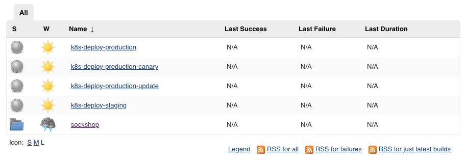
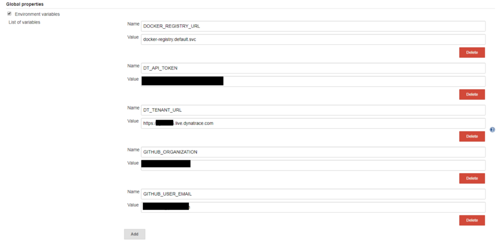
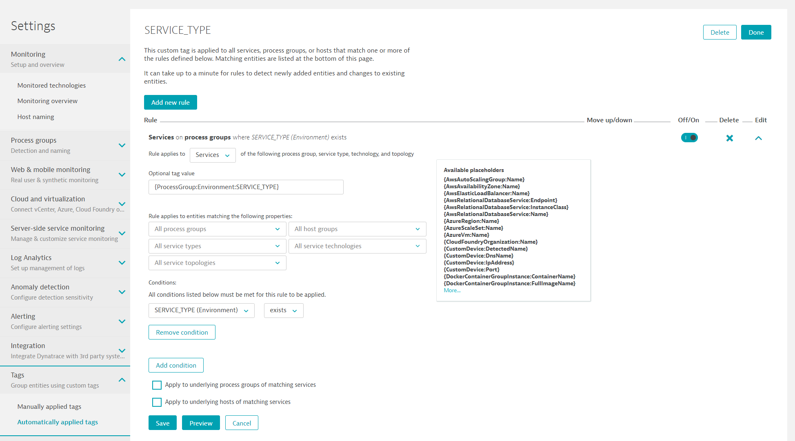

# Provision ACM Workshop Cluster on OpenShift

This repository contains all scripts and instructions needed to deploy the ACM Sockshop demo to OpenShift (3.11).
## Prerequisites:

* jq (https://stedolan.github.io/jq/) has to be installed to run the setup script.
* A GitHub Organization to fork the Sockshop application to
* A GitHub Personal Access Token
* OpenShift command line util (oc), and logged in to your cluster
* Git CLI & [Hub CLI](https://hub.github.com/)
* A Dynatrace Tenant - you will need the Dynatrace Tenant ID, a Dynatrace API Token and Dynatrace PaaS Token to complete the setup.

## Instructions:

1. Execute the `~/forkGitHubRepositories.sh` script in your home directory. This script takes the name of the GitHub organization you have created earlier.

    ```
    $ ./scripts/forkGitHubRepositories.sh <GitHubOrg>
    ```

    This script `clone`s all needed repositories and the uses the `hub` command ([hub](https://hub.github.com/)) to fork those repositories to the passed GitHub organization. After that, the script deletes all repositories and `clone`s them again from the new URL.
    
1. Insert information in ./scripts/creds.json by executing *./scripts/creds.sh* - This script will prompt you for all information needed to complete the setup, and populate the file *scripts/creds.json* with them.


    ```
    $ ./scripts/creds.sh
    ```
    
1. Execute *./scripts/createJenkins.sh* - This will deploy a Jenkins service within your OpenShift Cluster, as well as an initial deployment of the sockshop application in the *dev*, *staging* and *production* namespaces. 
*Note that the script will run for some time (~5 mins), since it will wait for Jenkins to boot and set up some credentials via the Jenkins REST API.*


    ```
    $ ./scripts/createJenkins.sh
    ```
    
1. Afterwards, you can login using the default Jenkins credentials (admin/AiTx4u8VyUV8tCKk). It's recommended to change these credentials right after the first login. You can get the URL of Jenkins by executing

```
$ oc get route jenkins -n cicd
``` 

1. Verify the installation: In the Jenkins dashboard, you should see the following pipelines:

* k8s-deploy-production
* k8s-deploy-production-canary
* k8s-deploy-production-update
* k8s-deploy-staging
* A folder called *sockshop*



Further, navigate to Jenkins > Manage Jenkins > Configure System, and see if the Environment Variables used by the build pipelines have been set correctly (Note that the value for the parameter *DT_TENANT_URL* should start with 'https://'):



1. Verify your deployment of the Sockshop service: Execute the following commands to retrieve the URLs of your front-end in the dev, staging and production environments:

```
$ oc get route front-end -n dev
``` 
```
$ oc get route front-end -n staging
``` 
```
$ oc get route front-end -n production
``` 

## Setup Tagging of Services and Naming of Process Groups in Dynatrace

This allows you to query service-level metrics (e.g.: Response Time, Failure Rate, or Throughput) automatically based on meta-data that you have passed during a deployment, e.g.: *Service Type* (frontend, backend), *Deployment Stage* (dev, staging, production). Besides, this lab creates tagging rules based on Kubernetes namespace and Pod name.

In order to tag services, Dynatrace provides **Automated Service Tag Rules**. In this lab you want Dynatrace to create a new service-level tag with the name **SERVICE_TYPE**. It should only apply the tag *if* the underlying Process Group has the custom meta-data property **SERVICE_TYPE**. If that is the case, you also want to take this value and apply it as the tag value for **Service_Type**.

### Step 1: Create a Naming Rule for Process Groups
1. Go to **Settings**, **Process groups**, and click on **Process group naming**.
1. Create a new process group naming rule with **Add new rule**. 
1. Edit that rule:
    * Rule name: `Container.Namespace`
    * Process group name format: `{ProcessGroup:KubernetesContainerName}.{ProcessGroup:KubernetesNamespace}`
    * Condition: `Kubernetes namespace`> `exits`
1. Click on **Preview** and **Save**.

Screenshot shows this rule definition.


### Step 2: Create Service Tag Rule
1. Go to **Settings**, **Tags**, and click on **Automatically applied tags**.
1. Create a new custom tag with the name `SERVICE_TYPE`.
1. Edit that tag and **Add new rule**.
    * Rule applies to: `Services` 
    * Optional tag value: `{ProcessGroup:Environment:SERVICE_TYPE}`
    * Condition on `Process group properties -> SERVICE_TYPE` if `exists`
1. Click on **Preview** to validate rule works.
1. Click on **Save** for the rule and then **Done**.

Screenshot shows this rule definition.


### Step 3: Search for Services by Tag
It will take about 30 seconds until the tags are automatically applied to the services.
1. Go to **Transaction & services**.
1. Click in **Filtered by** edit field.
1. Select `SERVICE_TYPE` and select `FRONTEND`.
1. You should see the service `front-end`. Open it up.

### Step 4: Create Service Tag for App Name based on K8S Container Name
1. Go to **Settings**, **Tags**, and click on **Automatically applied tags**.
1. Create a new custom tag with the name `app`.
1. Edit that tag and **Add new rule**.
    * Rule applies to: `Services` 
    * Optional tag value: `{ProcessGroup:KubernetesContainerName}`
    * Condition on `Kubernetes container name` if `exists`
1. Click on **Preview** to validate rule works.
1. Click on **Save** for the rule and then **Done**.

### Step 5: Create Service Tag for Environment based on K8S Namespace
1. Go to **Settings**, **Tags**, and click on **Automatically applied tags**.
1. Create a new custom tag with the name `environment`.
1. Edit that tag and **Add new rule**.
    * Rule applies to: `Services` 
    * Optional tag value: `{ProcessGroup:KubernetesNamespace}`
    * Condition on `Kubernetes namespace` if `exists`
1. Click on **Preview** to validate rule works.
1. Click on **Save** for the rule and then **Done**.

## Updating your sockshop services:

* To deploy updates you made to your services to the development environment, you can follow the instructions at this location: (Deploy to dev)[https://github.com/dynatrace-innovationlab/acl-docs/tree/master/workshop/05_Developing_Microservices/02_Deploy_Microservice_to_Dev].

* To deploy your changes to the staging environment, please refer to the instructions at this location: (Deploy to Staging)[https://github.com/dynatrace-innovationlab/acl-docs/tree/master/workshop/05_Developing_Microservices/03_Deploy_Microservice_to_Staging].


